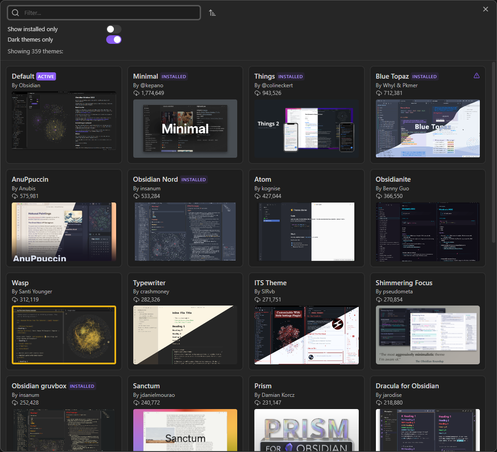
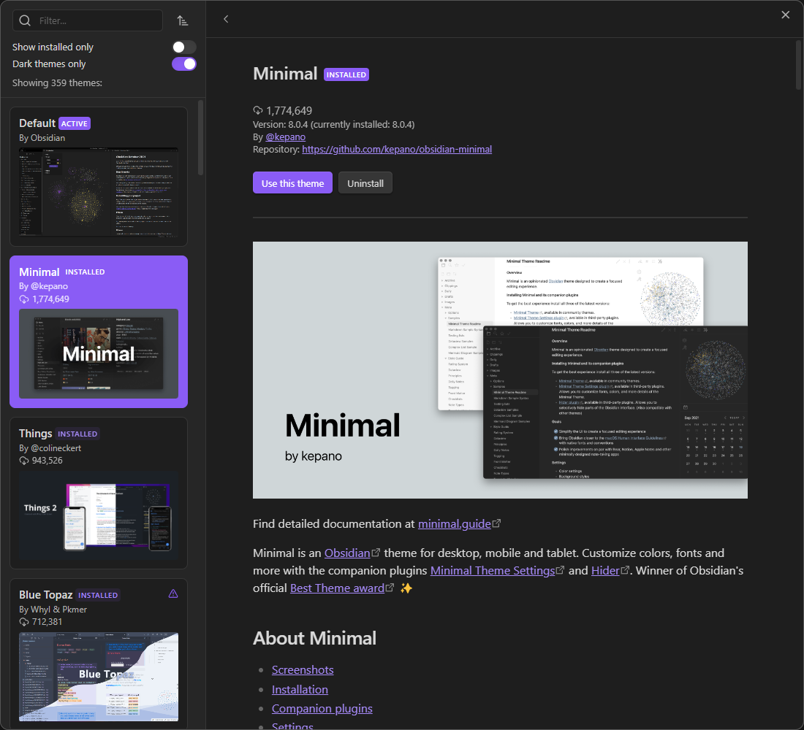

## Overview

Website to see what all of the different Obsidian themes look like on a sample data set.

## Why

The normal process for finding a theme in Obsidian is cumbersome and slow:
1. Go into settings → appearance → manage themes
2. Pick a theme based on tiny screenshots

3. If you're lucky, there will be a few screenshots, but they're still small and only vaguely show the general color scheme

4. Install and activate the theme
5. Close the options menu to finally see what it looks like on your vault

Instead of installing each theme to preview it, you can now see what it looks like on an actual Obsidian vault through this website.

## How Does It Work?

This project is made possible by [Obsidian Webpage Export](https://github.com/KosmosisDire/obsidian-webpage-export), which exports a vault to be viewed in a web browser. I take the exported HTML files and modify them using Python to add the HTML and JavaScript code that allows users to quickly switch between different themes and toggle between light and dark mode.
